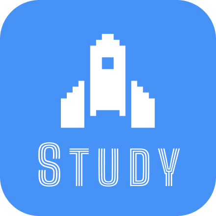

# StudySpace

StudySpace는 강의노트와 학습 자료를 과목별로 모으고 복습하는 개인 학습 공간입니다.

노트, 마인드맵, 인포그래픽, 퀴즈, 플래시카드로 이어지는 AI 학습 경험을 만들어 갑니다. 강의 녹음과 구간 재생, 학교 시간표 연동도 순차적으로 개발합니다.

현재 이메일 회원가입·로그인과 카카오 로그인 기반을 구현했으며, 과목별 노트 관리 기능을 개발하고 있습니다.
