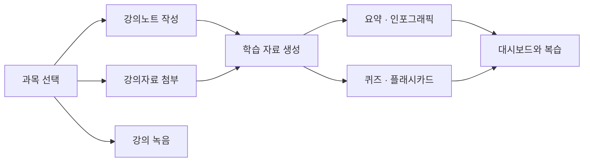
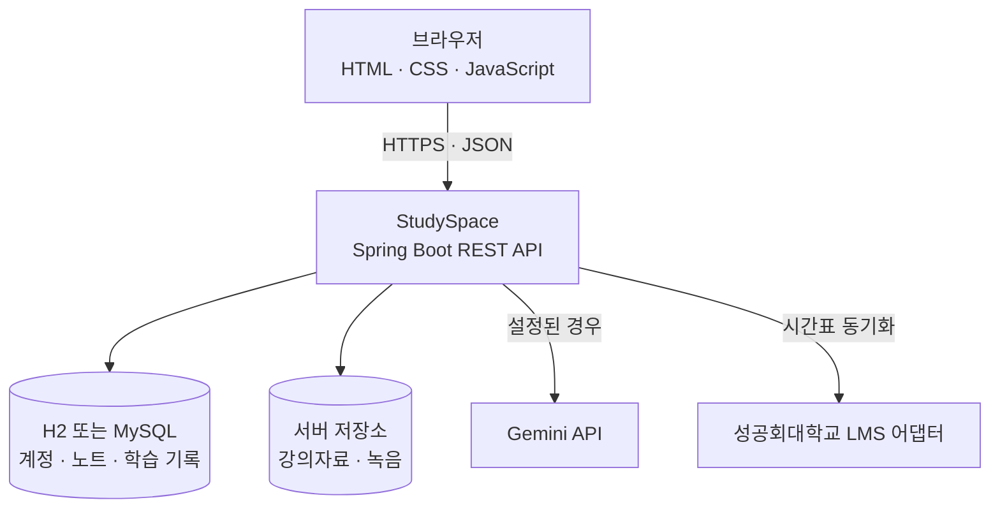

# StudySpace

<p align="center">
  
</p>

<p align="center"><strong>강의 자료를 모으고, 이해하고, 다시 꺼내 공부하는 공간</strong></p>

StudySpace는 대학생의 강의노트, 강의자료, 녹음을 과목별로 정리하고, 이를 요약·인포그래픽·퀴즈·플래시카드로 연결하는 학습관리 웹 서비스입니다. 자료를 보관하는 데서 그치지 않고 수업 직후의 기록부터 시험 전 복습까지 한 흐름으로 이어지도록 만들었습니다.

**서비스:** [studyspace.omong.kr](https://studyspace.omong.kr) · **소스 코드:** [github.com/junseok0304/studyspace](https://github.com/junseok0304/studyspace)

## 학습 흐름


```mermaid
flowchart LR
    A[과목 선택] --> B[강의노트 작성]
    A --> C[강의자료 첨부]
    A --> D[강의 녹음]
    B --> E[학습 자료 생성]
    C --> E
    E --> F[요약 · 인포그래픽]
    E --> G[퀴즈 · 플래시카드]
    F --> H[대시보드와 복습]
    G --> H
```

## 주요 기능

| 영역 | 기능 |
| --- | --- |
| 과목과 노트 | 학기·과목별 노트 작성, Markdown 편집과 미리보기, 초안 복구, Markdown 가져오기 |
| 강의자료 | PDF·PPTX·HWP·이미지 자료 업로드와 분석, 첨부자료 내용을 반영한 학습 지원 |
| AI 복습 | 노트와 강의자료를 바탕으로 요약, 글과 도식 중심 인포그래픽, 퀴즈, 플래시카드 생성 |
| 강의 녹음 | 과목 단위 녹음 보관, 노트 연결, 최대 60분 녹음, 구간 탐색과 이어 듣기 |
| 수업 관리 | 성공회대학교 LMS 시간표 연동, 학기와 과목 구성, 수업·노트 활동 대시보드 |
| 계정과 사용량 | 이메일 인증·비밀번호 재설정, 계정별 일일 AI 30회 사용량 확인 |

노트가 수정되면 이전에 만든 학습 자료가 원본과 달라졌음을 확인할 수 있도록 관리합니다. 퀴즈 풀이와 플래시카드 복습 결과는 대시보드에서 이어서 확인할 수 있습니다.

## 구현 개요

- **하나의 원천 자료에서 복습까지:** 노트와 첨부자료를 학습 자료의 근거로 사용하고, 생성 결과와 풀이 기록을 과목·노트 맥락에 맞춰 관리합니다.
- **실제 공부 흐름에 맞춘 작업 공간:** 강의노트, 자료, 녹음, AI 복습 도구와 학습 현황을 한 서비스 안에서 오갈 수 있습니다.
- **녹음 저장 복구:** 녹음을 작은 단위로 저장하고, 연결이 끊기거나 로그인 세션이 만료된 경우에도 브라우저에 남은 녹음 데이터를 복구해 다시 전송할 수 있도록 구성했습니다.
- **계정별 AI 사용 제한:** AI 요청 사용량을 계정 단위로 집계하며, 한국 시간 기준 매일 자정에 초기화합니다.

## 기술 구성

| 구분 | 기술 |
| --- | --- |
| 웹 화면 | HTML, CSS, Vanilla JavaScript, Markdown 렌더링 |
| 서버 | Java 21, Spring Boot, Spring Security, REST API |
| 데이터 | H2 파일 데이터베이스 또는 Docker Compose의 MySQL 구성 |
| AI | Gemini API, 구조화된 학습 콘텐츠 생성과 결과 검증 |
| 자료 처리 | PDFBox, Apache POI, Python 기반 LMS 연동 어댑터 |
| 배포 | Docker, Docker Compose, Ubuntu 서버 |


```mermaid
flowchart TB
    Browser["브라우저<br/>HTML · CSS · JavaScript"] -->|HTTPS · JSON| App["StudySpace<br/>Spring Boot REST API"]
    App --> DB[("H2 또는 MySQL<br/>계정 · 노트 · 학습 기록")]
    App --> Files[("서버 저장소<br/>강의자료 · 녹음")]
    App -->|설정된 경우| Gemini[Gemini API]
    App -->|시간표 동기화| LMS[성공회대학교 LMS 어댑터]
```

로컬 기본 실행은 H2를 사용합니다. `compose.yml`은 MySQL과 앱을 함께 실행하는 개발 구성이며, 파일 데이터베이스 기반 운영 구성은 `compose.production.yml`에서 확인할 수 있습니다.

## 로컬에서 실행하기

### 준비물

- Java 21
- Gradle 9 이상
- Node.js와 npm

### 실행

```sh
git clone https://github.com/junseok0304/studyspace.git
cd studyspace
npm ci
npm run build
cp .env.example .env
```

`.env`에서 AI 실행 방식을 선택합니다.

- **모의 응답으로 실행:** `STUDYSPACE_AI_MOCK_ENABLED=true`로 설정합니다. Gemini API 키 없이 화면과 학습 흐름을 확인할 수 있습니다.
- **Gemini 연결:** `GEMINI_API_KEY`에 발급받은 키를 입력하고 `STUDYSPACE_AI_MOCK_ENABLED=false`로 설정합니다. 필요하면 `STUDYSPACE_AI_MODEL`도 지정합니다.

서버를 실행합니다.

```sh
./scripts/run-local.sh
```

브라우저에서 [http://localhost:8091](http://localhost:8091)을 엽니다. 로컬 데이터베이스와 업로드 파일은 기본적으로 `runtime/` 아래에 생성됩니다.

## 테스트

```sh
npm test
gradle test --no-daemon
```

## 환경 설정 참고

| 변수 | 설명 |
| --- | --- |
| `GEMINI_API_KEY` | Gemini API 키. 실제 AI 생성을 사용할 때 설정 |
| `STUDYSPACE_AI_MODEL` | Gemini 모델 이름 |
| `STUDYSPACE_AI_MOCK_ENABLED` | 결정적인 예시 응답을 쓰려면 `true`, Gemini를 사용하려면 `false` |
| `STUDYSPACE_DB_URL` | 데이터베이스 URL. 미설정 시 로컬 H2 파일 사용 |
| `STUDYSPACE_UPLOAD_DIR` | 강의자료 저장 위치 |
| `STUDYSPACE_RECORDING_DIR` | 녹음 파일 저장 위치 |
| `STUDYSPACE_STORAGE_LIMIT_BYTES` | 계정별 첨부자료·녹음 저장 한도. 기본값은 3 GiB |
| `STUDYSPACE_KAKAO_ENABLED` | 카카오 로그인을 사용하도록 설정 |

비밀키와 계정 비밀번호는 `.env`에만 두고 저장소에 올리지 마세요. `.env.example`에는 설정 항목과 예시 값만 포함되어 있습니다.

## 개발

StudySpace는 기획, 화면 설계, 프론트엔드와 백엔드, AI 연동, 테스트, 서버 배포까지 한 명이 직접 구현하고 실제 학습에 사용하며 개선하고 있는 프로젝트입니다.
