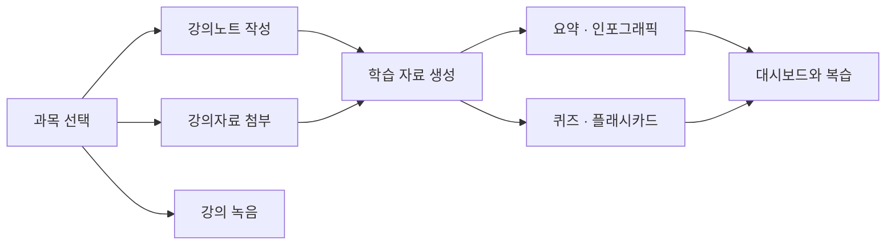
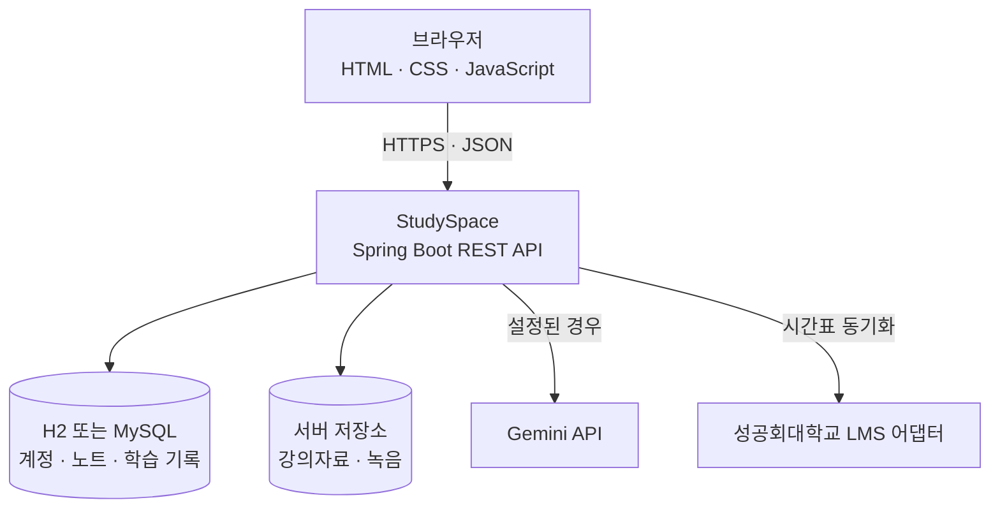

# StudySpace

  

<strong>강의 자료를 정리하고, 이해하고, 다시 공부하는 공간</strong>

StudySpace는 강의노트와 강의자료, 녹음을 과목별로 관리하고 이를 요약·인포그래픽·퀴즈·플래시카드로 연결하는 학습관리 서비스입니다. 수업 내용을 기록하는 순간부터 시험을 앞두고 복습하는 과정까지 한곳에서 이어갈 수 있습니다.

**서비스:** [studyspace.omong.kr](https://studyspace.omong.kr) · **소스 코드:** [github.com/junseok0304/studyspace](https://github.com/junseok0304/studyspace)

## 학습 흐름

```mermaid
flowchart LR
    A[과목 선택] --> B[강의노트 작성]
    A --> C[강의자료 첨부]
    A --> D[강의 녹음]
    B --> E[학습 자료 생성]
    C --> E
    E --> F[요약 · 인포그래픽]
    E --> G[퀴즈 · 플래시카드]
    F --> H[대시보드와 복습]
    G --> H
```

## 주요 기능

| 영역 | 기능 |
| --- | --- |
| 과목과 노트 | 학기·과목별 노트 작성, Markdown 편집과 미리보기, 초안 복구, Markdown 가져오기 |
| 강의자료 | PDF·PPTX·HWP·이미지 자료 업로드와 분석, 첨부자료 내용을 반영한 학습 지원 |
| AI 복습 | 노트와 강의자료를 바탕으로 요약, 글과 도식 중심 인포그래픽, 퀴즈, 플래시카드 생성 |
| 강의 녹음 | 과목 단위 녹음 보관, 노트 연결, 최대 60분 녹음, 구간 탐색과 이어 듣기 |
| 수업 관리 | 성공회대학교 LMS 시간표 연동, 학기와 과목 구성, 수업·노트 활동 대시보드 |
| 계정과 사용량 | 이메일 인증·비밀번호 재설정, 계정별 일일 AI 30회 사용량 확인 |

노트를 수정하면 기존 학습 자료가 최신 내용과 달라졌는지 확인할 수 있습니다. 퀴즈 풀이와 플래시카드 학습 결과도 대시보드에서 살펴볼 수 있습니다.

## 구현 개요

- **수업 자료와 복습의 연결:** 노트와 첨부자료를 바탕으로 학습 콘텐츠를 만들고, 과목과 노트에 맞춰 결과와 학습 기록을 관리합니다.
- **수업에 맞춘 통합 작업 공간:** 노트 작성, 자료 확인, 녹음, 복습, 학습 현황 확인을 한 서비스에서 이어갑니다.
- **안정적인 녹음 보관:** 녹음을 작은 구간으로 저장합니다. 연결이 끊기거나 로그인이 만료되어도 브라우저에 남은 녹음을 복구해 다시 저장할 수 있도록 지원합니다.
- **계정별 AI 사용량 관리:** AI 사용량을 계정별로 집계하고 한국 시간 기준 매일 초기화합니다.

## 기술 구성

| 구분 | 기술 |
| --- | --- |
| 웹 화면 | HTML, CSS, Vanilla JavaScript, Markdown 렌더링 |
| 서버 | Java 21, Spring Boot, Spring Security, REST API |
| 데이터 | H2 파일 데이터베이스 또는 Docker Compose의 MySQL 구성 |
| AI | Gemini API, 구조화된 학습 콘텐츠 생성과 결과 검증 |
| 자료 처리 | PDFBox, Apache POI, Python 기반 LMS 연동 어댑터 |
| 배포 | Docker, Docker Compose, Ubuntu 서버 |

```mermaid
flowchart TB
    Browser["브라우저<br/>HTML · CSS · JavaScript"] -->|HTTPS · JSON| App["StudySpace<br/>Spring Boot REST API"]
    App --> DB[("H2 또는 MySQL<br/>계정 · 노트 · 학습 기록")]
    App --> Files[("서버 저장소<br/>강의자료 · 녹음")]
    App -->|설정된 경우| Gemini[Gemini API]
    App -->|시간표 동기화| LMS[성공회대학교 LMS 어댑터]
```
